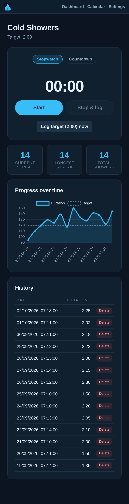
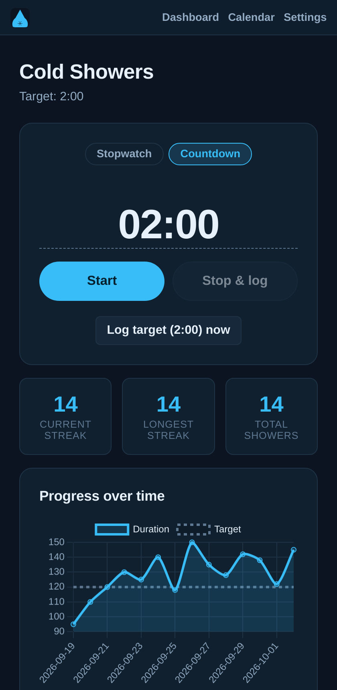
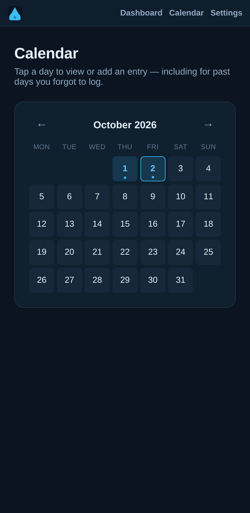
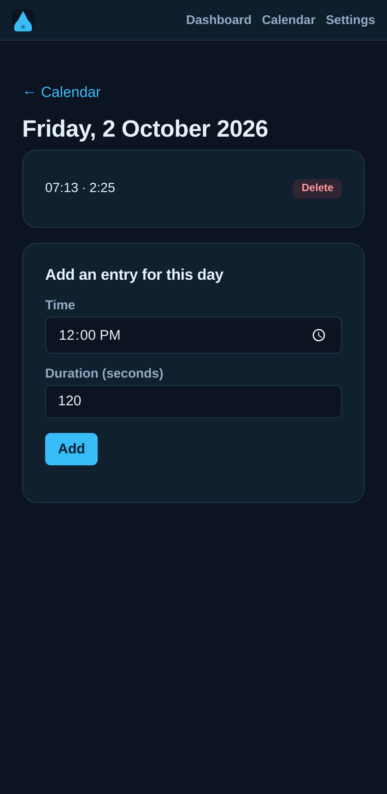
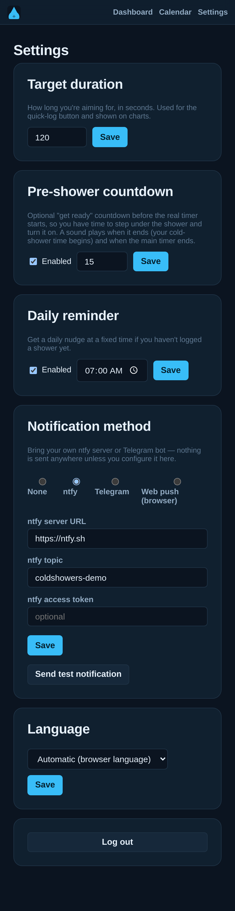
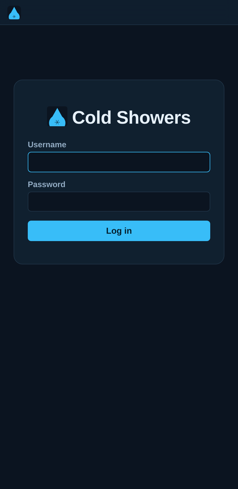

# Cold Showers

A small self-hosted tracker for cold showers: a timer (with an optional pre-shower "get ready" countdown), streaks, a progress chart, a calendar for logging retroactively, and an optional reminder.



## Features

- **Timer**: stopwatch or countdown mode (tap the countdown display to adjust it on the fly), start/stop to log the actual duration, or a one-tap "log target duration now" button. The last-used mode is remembered per device.
- **Optional pre-shower countdown**: a configurable "get ready" countdown before the real timer starts, so you have time to step under the shower and turn it on. A clear alarm sound plays at the handoff into cold-shower time, and again when the timer ends.
- **Configurable target**: default 2 minutes, adjustable in Settings.
- **Streaks and chart**: current/longest streak, total count, and a duration-over-time chart (Chart.js).
- **Calendar view**: see which days you logged a shower, and add entries retroactively for days you forgot.
- **Configurable reminder**: a daily nudge at a time you choose.
- **Bring-your-own notifications**: the reminder can be sent via [ntfy](https://ntfy.sh) (your own server/topic), your own Telegram bot, or browser web push — nothing is hardcoded to any specific deployment, so plug in your own credentials.
- **Installable PWA**: add it to your home screen for an app-like experience, with offline-ready app shell assets.
- **Login**: single-user, session-based (cookie), first launch walks you through creating the one account.
- **English and Dutch** UI (English by default).

<details>
<summary>More screenshots</summary>

| Countdown mode | Calendar | Log a past session |
|---|---|---|
|  |  |  |

| Settings | Login |
|---|---|
|  |  |

</details>

## Running it

```sh
docker compose up -d --build
```

The app listens on port 3000 inside the container. Data is stored as SQLite under `./data` — back that directory up however you already back up the rest of your Docker volumes.

Put this behind your own reverse proxy (Caddy, nginx, Traefik, ...) for TLS; it's designed to run on a private network (e.g. behind a VPN/Tailscale) since it isn't hardened for direct public exposure.

### Environment variables

| Variable | Default | Purpose |
|---|---|---|
| `DATABASE_PATH` | `/data/coldshowers.db` | SQLite file location |
| `SESSION_SECRET` | random on each restart if unset | set this to a fixed value so logins survive a container restart |
| `PORT` | `3000` | HTTP port |
| `VAPID_PUBLIC_KEY` / `VAPID_PRIVATE_KEY` | unset | enables the "Web push" reminder method; generate your own with `npx web-push generate-vapid-keys` |
| `VAPID_SUBJECT` | unset | a `mailto:` address required by the push protocol, used only to identify your deployment to push services |

## Notifications

Configure the reminder method per-user in Settings, not via environment variables (except web push's VAPID keypair, which is deployment-wide — see above) — each user brings their own:

- **ntfy**: server URL (defaults to the public `https://ntfy.sh`), topic name, and an optional access token.
- **Telegram**: your own bot token (create one via [@BotFather](https://t.me/BotFather)) and your chat ID.
- **Web push**: once the server has a VAPID keypair configured, enable push notifications per-browser/device from Settings — no extra credentials needed from the user.

## Tech stack

Express, EJS, better-sqlite3, express-session with a SQLite-backed store — no build step, no external services required beyond whatever notification channel you choose to configure.
